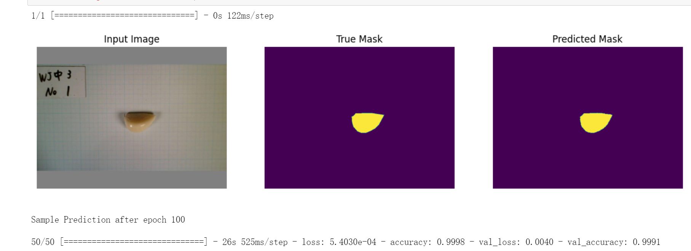

# AgricultureDetection
Detect the crops picture like garlic based on tensorflow-unet and calculate the areas of the garlic seeds.

[The easiest way to train a U-NET Image Segmentation model using TensorFlow and labelme
](https://makeoptim.com/en/deep-learning/yiai-unet)

Build [U-Net](https://arxiv.org/abs/1505.04597) with [TensorFlow 2](https://www.tensorflow.org/) and train a dataset annotated with [labelme](https://github.com/wkentaro/labelme).

**Project images and datasets are from Okayama University, please replace them with your own datasets when using them**



## Installation

1.1 If you are using **macOS**, you need to execute the following command before installation.

```shell
> brew install pyqt
```

1.2 Execute the following command to install the unet environment.

```shell
> conda create -n unet -y python=3.9 && conda activate unet && pip install -r requirements.txt
```

2.1 If you are using **linux-ubuntu**, you can run the Docker to configure your development environment.
```shell
> docker build -t image_name:image_version
```

2.2 Then create your container and go into it.
```shell
> docker run -it -p ipaddress:port:binding_port container_name /bin/bash
```
please replace it with your ipaddress and port.

2.3 Use jupyter notebook to train your datasets.
```shell
> jupyter notebook --allow-root
```

# Datasets

### Annotate images

Annotate images with [labelme](https://github.com/wkentaro/labelme).

### Generate VOC format dataset

Save the labeled training data to `datasets/train`, and create a new `datasets/labels.txt`, the content is the classification names, see <https://github.com/wkentaro/labelme/tree/main/examples/semantic_segmentation>

Execute the following command to generate the voc dataset.

```sh
> make voc
```

> Note: If you want to regenerate and overwrite the old one, you can execute the following command.
>
> ```sh
> > make re-voc
> ```
## Training

Train and predict with [unet.ipynb](./unet.ipynb)

Ps: This improved application refers to [CatchZeng
/
tensorflow-unet-labelme](https://github.com/CatchZeng/tensorflow-unet-labelme)